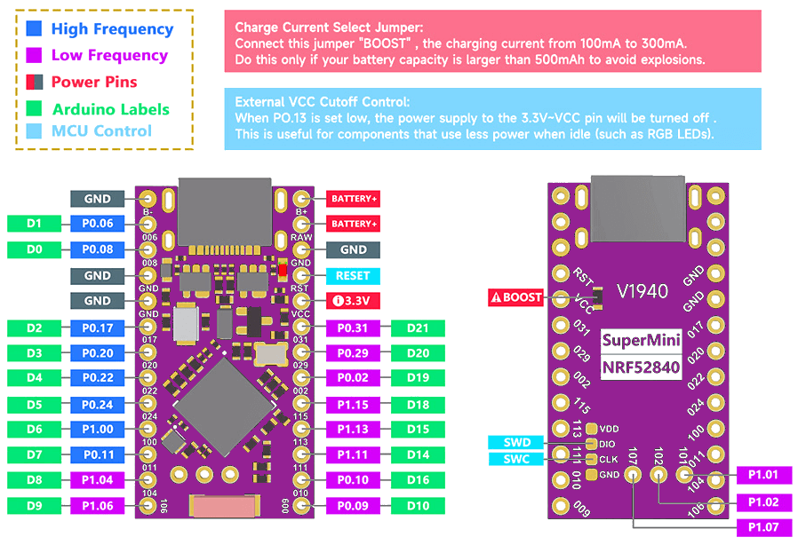

# zmk-config-test

> forked from [mbalyura/zmk-config-promicro52840](https://github.com/mbalyura/zmk-config-promicro52840)

ZMK keyboard configuration for the Promicro NRF52840 shield, that utilizes all available controller pins (incliding 3 additional in the middle of PCB, 21 pin in total!).

Tested with Promicro NRF52840 from Aliexpress. Should work with NiceNano! V2 as well.

Can be used for testing and as reference.

